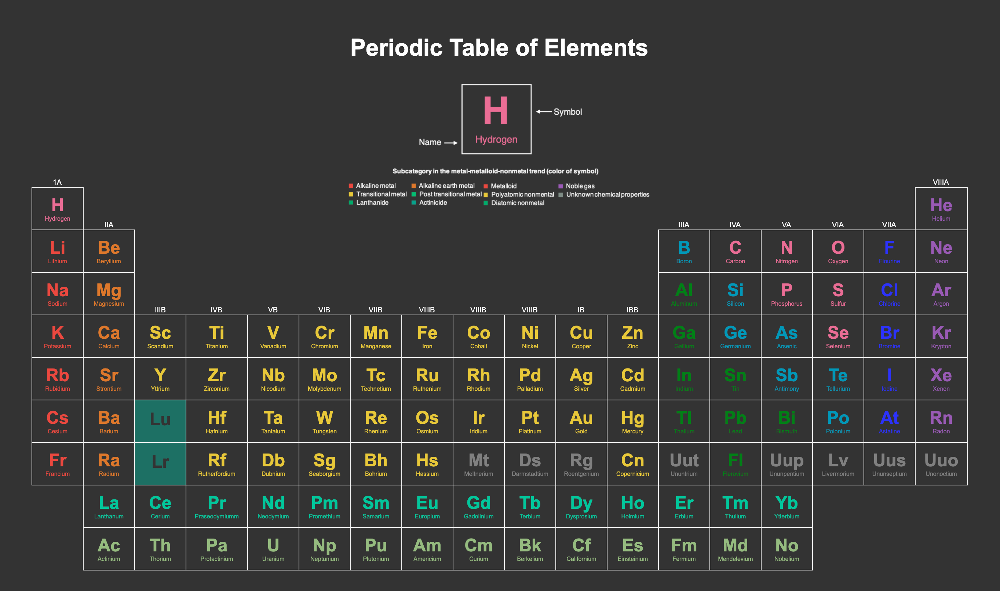

# periodicTable

This is a tabular display of the chemical elements arranged by state of matter and metaloid trend.

### Notes on the table:

HTML

- Traditional tables was utilized to order the elements. No CSS Grid / FlexBox was used.
- No class / id attributes was used.

CSS:

- No class / id selectors.
- Project was limited to the use of parent-child selectors.
