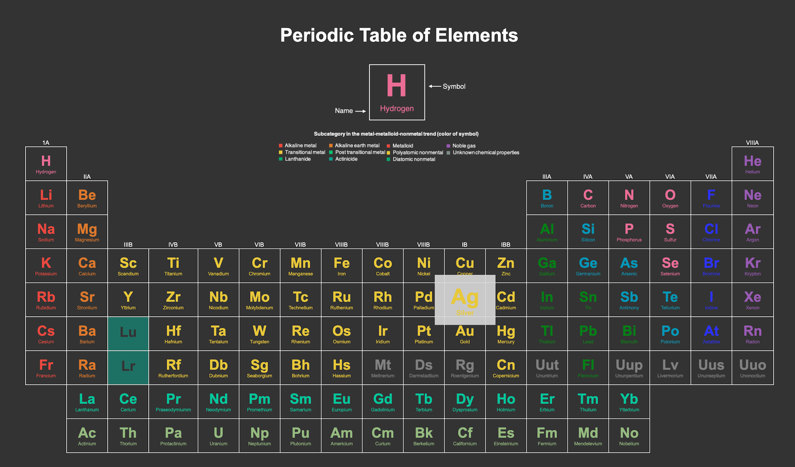

# periodicTable

This is a tabular display of the chemical elements arranged by state of matter and metaloid trend.

### Task:
- Create a periodic table of elements without using classes and ids.

### Notes on the table:

- Traditional tables were utilized to order the elements.
- No class / id attributes was used.

CSS:
- No class / id selectors.
- No CSS Grid / FlexBox was used.
